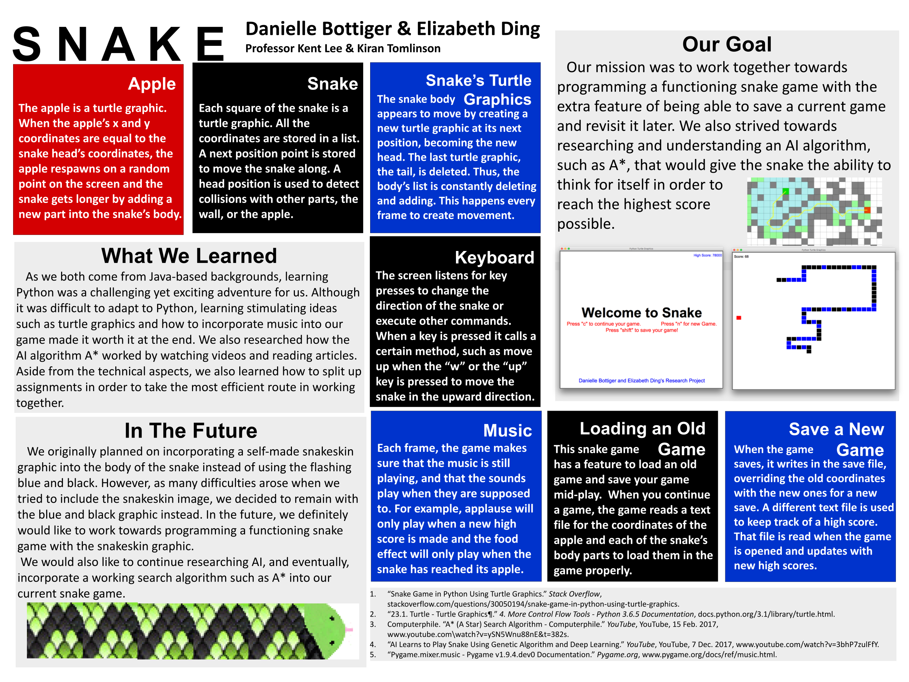

# Snake

This is my first Python project. It was made as my capstone project for the 2018 Summer Computer Science Institute at Carleton College. At this point, I hadn't started my bachleor's degree and only had programming experience from AP Computer Science and the institute itself.

On the poster, I wrote I had wanted to add pathfinding to the snake's capabilities but it ended up being out of scope for my abilities at the time. Later, when I attended Carleton, I was able to implement A* for another project (Winter 2021) and created a pathfinding Snake AI that uses reinforncement learning in another (Winter 2023).